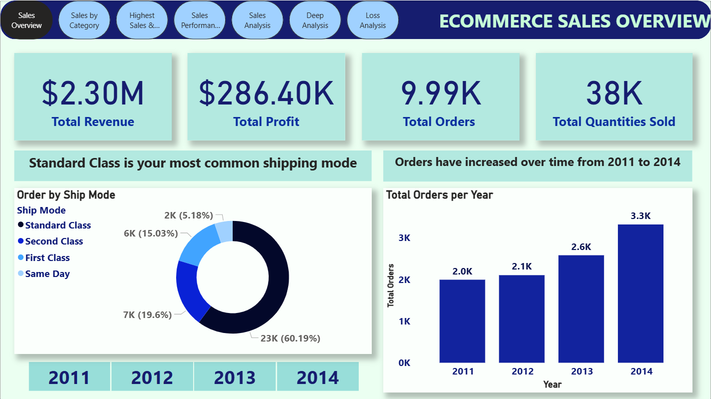

# E-commerce Sales Analysis Dashboard | Power BI Project

## 📌 Project Overview

This project is an interactive **E-commerce Sales Analysis Dashboard** developed in **Microsoft Power BI** to analyze sales performance, customer behavior, profitability, and operational trends for an online retail business.

The dashboard transforms raw transactional data into actionable insights using visual storytelling, KPI cards, slicers, trend charts, and category-level analysis. It enables business stakeholders to monitor growth, identify profitable segments, optimize sales strategies, and improve decision-making.

## 🛠️ Tools & Technologies Used

- Microsoft Power BI  
- Power Query  
- DAX (Data Analysis Expressions)  
- Excel Dataset  
- Data Modeling  
- Interactive Dashboard Design

---

## 📂 Files Included

| File Name | Description |
|-----------|-------------|
| `BI workshop Project.pbix` | Power BI dashboard project file |
| `Ecommerce Sales Analysis.xlsx` | Source dataset used for dashboard development |

---

## 📊 Business Objective

To create a centralized dashboard that helps management track:

- Total Sales Performance  
- Revenue Growth Trends  
- Profitability Analysis  
- Customer Purchase Behavior  
- Product Category Performance  
- Regional / Segment Sales Insights  
- Order Trends & Operational Metrics

---

## 📈 Dashboard Highlights

### Executive KPI Cards
Quick summary of major business metrics such as:

- Total Sales  
- Total Profit  
- Total Orders  
- Average Order Value  
- Profit Margin  
- Customer Count

### Sales Trend Analysis

Track performance across:

- Monthly Sales Trends  
- Quarterly Growth  
- Seasonal Demand Patterns  
- Year-over-Year Comparison

### Product Performance

Analyze:

- Top Selling Products  
- Low Performing Products  
- Category-wise Revenue  
- Sub-category Contribution

### Profitability Insights

Identify:

- High Margin Categories  
- Loss-making Products  
- Discount Impact on Profit  
- Region-wise Profit Trends

### Customer Analytics

Understand:

- Repeat vs New Customers  
- High Value Customers  
- Purchase Frequency  
- Customer Segmentation

### Geographic Analysis

Visual maps / charts for:

- State-wise Sales  
- Region-wise Profitability  
- Location-wise Order Concentration

---

## 📊 Dashboard Features

- Interactive Filters / Slicers  
- Drill-through Pages  
- Dynamic KPI Cards  
- Trend Visualizations  
- Product Ranking  
- Region Comparison  
- Clean Executive Layout

---

## 📈 Business Value

This dashboard helps organizations:

- Improve revenue visibility  
- Optimize product portfolio  
- Increase profitability  
- Track business growth trends  
- Enhance customer retention strategies  
- Make faster management decisions

---

## 🧠 Skills Demonstrated

- Data Cleaning using Power Query  
- Data Modeling & Relationships  
- DAX Measures Creation  
- Dashboard UI/UX Design  
- Business Storytelling with Data  
- Performance KPI Development  
- Visual Analytics

---

## 📷 Dashboard Preview

## 🚀 Why This Project Matters

E-commerce businesses generate massive transactional data daily. This dashboard converts raw data into strategic insights that help management increase sales, reduce inefficiencies, and grow profitably.

---
