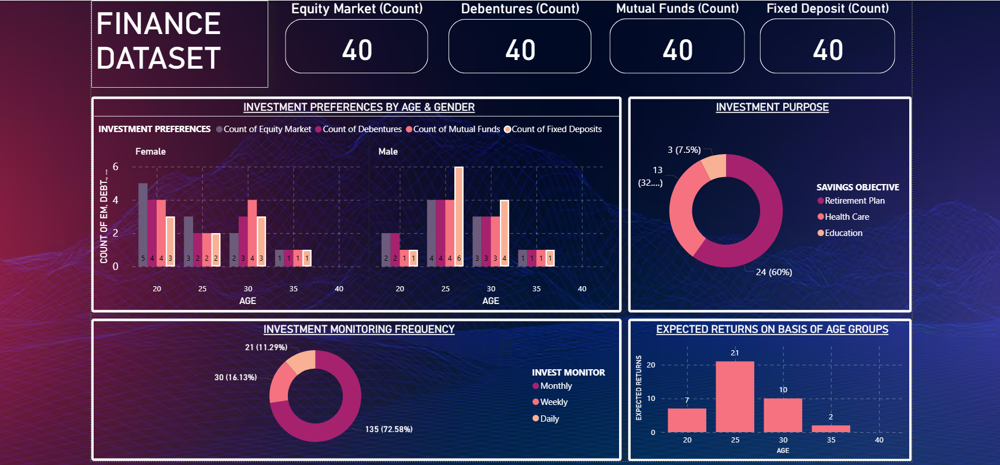

# Power BI Projects Portfolio

## 📌 Project Overview

Welcome to my **Power BI Projects Portfolio** — a dedicated repository showcasing interactive dashboards and business intelligence solutions built using **Microsoft Power BI**. These projects focus on transforming raw data into meaningful insights through dynamic visualizations, KPI tracking, trend analysis, and executive-level reporting.

The repository includes projects across multiple business domains such as **Finance, Sales, HR, Operations, Marketing, and Analytics**, designed to support data-driven decision-making.

## 🛠️ Tools & Technologies Used

- Microsoft Power BI  
- Power Query  
- DAX (Data Analysis Expressions)  
- Data Modeling  
- Excel / CSV Data Sources  
- Interactive Dashboards  
- Business Intelligence Reporting

---

## 📂 Repository Structure

| Folder / File | Description |
|--------------|-------------|
| `Finance.pbix` | Finance analytics dashboard project |
| `Finance_data.csv` | Source dataset used in Finance dashboard |
| Future Projects | Additional Power BI dashboards from different domains |

---

# 📊 Featured Project: Finance Dashboard

## 📌 Description

This project is a **Finance Performance Dashboard** built in Power BI to monitor financial health, profitability, trends, and operational efficiency. It helps businesses track revenue performance, expenses, profit margins, and other critical financial KPIs.

## 📈 Key Dashboard Highlights

- Revenue Overview  
- Expense Analysis  
- Profit & Loss Tracking  
- Monthly / Quarterly Trends  
- Budget vs Actual Comparison  
- Category-wise Financial Breakdown  
- Interactive Filters & Drilldowns  
- Executive KPI Summary Cards

## 📊 Business Value

This dashboard helps stakeholders:

- Monitor business profitability  
- Control expenses effectively  
- Identify growth trends  
- Compare planned vs actual performance  
- Improve strategic financial decisions  
- Generate faster management reports

---

## 🚀 Why This Repository?

This repository demonstrates my ability to:

- Build professional dashboards  
- Convert raw data into insights  
- Use DAX for advanced calculations  
- Design interactive reports  
- Perform business analytics storytelling  
- Support management decision-making

---

## 📌 Future Dashboards Planned

- Sales Performance Dashboard  
- HR Analytics Dashboard  
- Marketing Dashboard  
- Supply Chain Dashboard  
- Customer Insights Dashboard  
- Executive KPI Dashboard

---

## 💼 Skills Demonstrated

- Data Cleaning using Power Query  
- Data Modeling & Relationships  
- KPI Dashboard Design  
- DAX Measures & Calculations  
- Drill-through Reporting  
- Trend & Variance Analysis  
- Dashboard Storytelling

---

## 📷 Dashboard Preview

