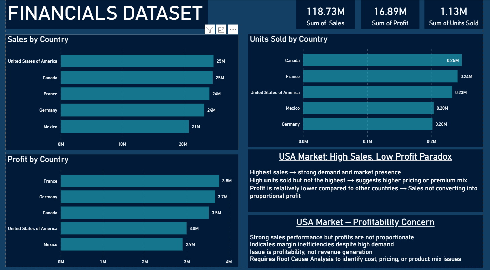

# Financial Performance Dashboard | Power BI Project

## 📌 Project Overview

This project is an interactive **Financial Performance Dashboard** built in **Microsoft Power BI** to analyze business revenue, profit, expenses, growth trends, and overall financial health.

The dashboard converts raw financial data into meaningful insights through KPI cards, trend charts, profitability analysis, regional breakdowns, and executive reporting views. It enables decision-makers to monitor performance, compare periods, identify profitable segments, and improve strategic planning.

## 🛠️ Tools & Technologies Used

- Microsoft Power BI  
- Power Query  
- DAX (Data Analysis Expressions)  
- Excel Dataset  
- Data Modeling  
- Interactive Dashboard Design

---

## 📂 Files Included

| File Name | Description |
|-----------|-------------|
| `Financials.pbix` | Power BI dashboard project file |
| `Financials(1).xlsx` | Source financial dataset used for dashboard |

---

## 📊 Business Objective

To develop a centralized dashboard that helps management track and analyze:

- Revenue Performance  
- Profit & Loss Trends  
- Sales by Product / Segment  
- Regional Financial Performance  
- Discount Impact  
- Monthly / Quarterly Growth  
- Operational Profitability

---

## 📈 Dashboard Highlights

### Executive KPI Cards

Quick overview of key financial indicators:

- Total Revenue  
- Total Profit  
- Total Cost  
- Gross Margin  
- Net Margin  
- Units Sold  
- Average Sales Value

### Revenue Trend Analysis

Track growth across time:

- Monthly Revenue Trends  
- Quarterly Performance  
- Year-over-Year Comparison  
- Seasonal Performance Patterns

### Profitability Analysis

Understand:

- High Profit Segments  
- Low Margin Products  
- Cost vs Revenue Comparison  
- Loss-making Areas  
- Margin Contribution by Category

### Product / Segment Performance

Analyze:

- Product-wise Sales  
- Segment-wise Revenue  
- Units Sold by Product  
- Best Performing Categories

### Regional Insights

Compare business performance by:

- Country / Region  
- Market Contribution  
- Profit by Geography  
- Sales Distribution

### Discount Analysis

Measure:

- Discount Impact on Profitability  
- Segment-wise Discounting  
- Revenue vs Discount Relationship

---

## 📊 Dashboard Features

- Interactive Filters / Slicers  
- Drill-through Reports  
- Dynamic KPI Cards  
- Comparative Trend Charts  
- Geographic Analysis  
- Product Ranking Visuals  
- Executive Summary Layout

---

## 📈 Business Value

This dashboard helps organizations:

- Improve financial visibility  
- Increase profitability  
- Monitor revenue growth  
- Control operational costs  
- Optimize discount strategy  
- Compare market performance  
- Make faster executive decisions

---

## 🧠 Skills Demonstrated

- Data Cleaning using Power Query  
- Data Modeling & Relationships  
- DAX Measures & KPIs  
- Financial Dashboard Design  
- Business Intelligence Reporting  
- Variance & Trend Analysis  
- Data Storytelling

---

## 📷 Dashboard Preview

## 🚀 Why This Project Matters

Finance teams require quick access to reliable business metrics. This dashboard simplifies complex financial data into a visual decision-making system that supports growth, profitability, and operational control.

---
